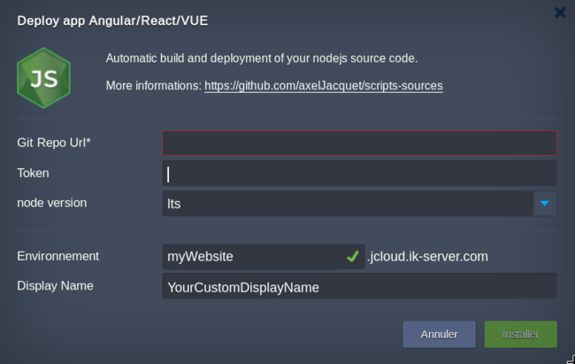

# Nodejs deployment

Dedicated nodejs/nginx server into docker container ultra slim for building source code and deploying nodesjs projects. Secured with built-in platform SSL.
Runners are automatically scaled vertically, horizontal scaling is available in a click.

## Installation Process

In the opened confirmation window at Jelastic dashboard, set an Environment name and optionally, customize its Display Name, set your git repository with token if your repository is private. You can choice node version for a perform build, I recommand lts version (actually 12.13.0).

Environment name matches with the final https url. On the screenshot the app will be deploy on https://myWebsite.jcloud.ik-server.com .

By default, Jelastic will issue a platform built-in SSL certificate for your application.
If you want have your custom domain, you can make an alias on the current Jelastic's domain ( in this case: https://myWebsite.jcloud.ik-server.com).

If you want have a private token:

[GitHub](https://github.com/jelastic-jps/git-push-deploy/wiki/GitHub-Access-Token)/[GitLab](https://github.com/jelastic-jps/git-push-deploy/wiki/GitLab-Access-Token)
